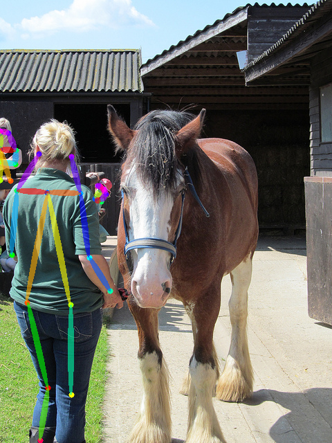
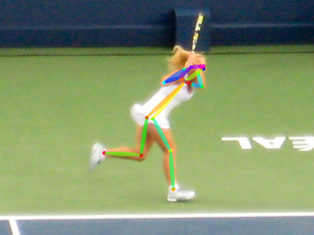

# PyTorchCV: A PyTorch-Based Framework for Deep Learning in Computer Vision
```
@misc{CV2018,
  author =       {Donny You (youansheng@gmail.com)},
  howpublished = {\url{https://github.com/youansheng/PyTorchCV}},
  year =         {2018}
}
```

This repository provides source code for some deep learning based cv problems. We'll do our best to keep this repository up to date.  If you do find a problem about this repository, please raise it as an issue. We will fix it immediately.


## Implemented Papers

- [Image Classification](https://github.com/youansheng/PyTorchCV/tree/master/methods/cls)
    - VGG: Very Deep Convolutional Networks for Large-Scale Image Recognition
    - ResNet: Deep Residual Learning for Image Recognition
    - DenseNet: Densely Connected Convolutional Networks
    - MobileNetV2: Inverted Residuals and Linear Bottlenecks
    - ResNeXt: Aggregated Residual Transformations for Deep Neural Networks
    - SqueezeNet: AlexNet-level accuracy with 50x fewer parameters and <0.5MB model size
    - ShuffleNet: An Extremely Efficient Convolutional Neural Network for Mobile Devices
    - ShuffleNet V2: Practical Guidelines for Ecient CNN Architecture Design

- [Pose Estimation](https://github.com/youansheng/PyTorchCV/tree/master/methods/pose)
    - CPM: Convolutional Pose Machines
    - OpenPose: Realtime Multi-Person 2D Pose Estimation using Part Affinity Fields
    
- [Object Detection](https://github.com/youansheng/PyTorchCV/tree/master/methods/det)
    - SSD: Single Shot MultiBox Detector
    - Faster R-CNN: Towards Real-Time Object Detection with Region Proposal Networks
    - YOLOv3: An Incremental Improvement
    - FPN: Feature Pyramid Networks for Object Detection
    
- [Semantic Segmentation](https://github.com/youansheng/PyTorchCV/tree/master/methods/seg)
    - DeepLabV3: Rethinking Atrous Convolution for Semantic Image Segmentation
    - PSPNet: Pyramid Scene Parsing Network
    - DenseASPP: DenseASPP for Semantic Segmentation in Street Scenes

- [Instance Segmentation](https://github.com/youansheng/PyTorchCV/tree/master/methods/seg)
    - Mask R-CNN


## Performances with PyTorchCV

#### Object Detection
- SSD: Single Shot MultiBox Detector [[SSD300](https://github.com/youansheng/PyTorchCV/blob/master/hypes/det/voc/ssd_vgg300_voc_det.json), [SSD512](https://github.com/youansheng/PyTorchCV/blob/master/hypes/det/voc/ssd_vgg512_voc_det.json)]

| Model | Training data  | Testing data | mAP | FPS  |
|--------|:---------:|:------:|:------:|:------:|
| [SSD-300 Origin](https://github.com/weiliu89/caffe/tree/ssd) | VOC07+12 trainval | VOC07 test | 0.772 | - |
| [SSD-300 Ours](https://drive.google.com/open?id=1iQfUe7u3kAMHmn0yEa9SRAJFj3Y5h0Dy) | VOC07+12 trainval | VOC07 test | 0.786 | - |
| [SSD-512 Origin](https://github.com/weiliu89/caffe/tree/ssd) | VOC07+12 trainval | VOC07 test | 0.798 | - |
| [SSD-512 Ours](https://drive.google.com/open?id=1eQ8eEOPVqHxH0hzenmzXDOF-8Zrvv8lg) | VOC07+12 trainval | VOC07 test | 0.804 | - |

- Faster R-CNN: Towards Real-Time Object Detection with Region Proposal Networks [[Faster R-CNN](https://github.com/youansheng/PyTorchCV/blob/master/hypes/det/voc/fr_vgg16_voc_det.json)]

| Model |  Training data  | Testing data | mAP | FPS  |
|--------|:---------:|:------:|:------:|:------:|
| [Faster R-CNN Origin](https://github.com/rbgirshick/py-faster-rcnn) | VOC07 trainval | VOC07 test | 0.699 | - |
| [Faster R-CNN Ours](https://drive.google.com/open?id=15SfklRiI1McVWEq9EAceznK-9sxXSQR4) | VOC07 trainval | VOC07 test | 0.706 | - |

- YOLOv3: An Incremental Improvement


## Commands with PyTorchCV

Take OpenPose as an example.
- Train the openpose model
```bash
python main.py  --hypes hypes/pose/coco/op_coco_pose.json \
                --base_lr 0.001 \
                --phase train \
                --gpu 0 1
```

- Finetune the openpose model
```bash
python main.py  --hypes hypes/pose/coco/op_coco_pose.json \
                --base_lr 0.001 \
                --phase train \
                --resume checkpoints/pose/coco/coco_open_pose_65000.pth \
                --gpu 0 1
```

- Test the openpose model(test_img):
```bash
python main.py  --hypes hypes/pose/coco/op_coco_pose.json \
                --phase test \
                --resume checkpoints/pose/coco/coco_open_pose_65000.pth \
                --test_img val/samples/ski.jpg \
                --gpu 0
```

- Test the openpose model(test_dir):
```bash
python main.py  --hypes hypes/pose/coco/op_coco_pose.json \
                --phase test \
                --resume checkpoints/pose/coco/coco_open_pose_65000.pth \
                --test_dir val/samples \
                --gpu 0
```

## Examples with PyTorchCV

<div align="center">



<p> Example output of <b>VGG19-OpenPose</b></p>



<p> Example output of <b>VGG19-OpenPose</b></p>

</div>

